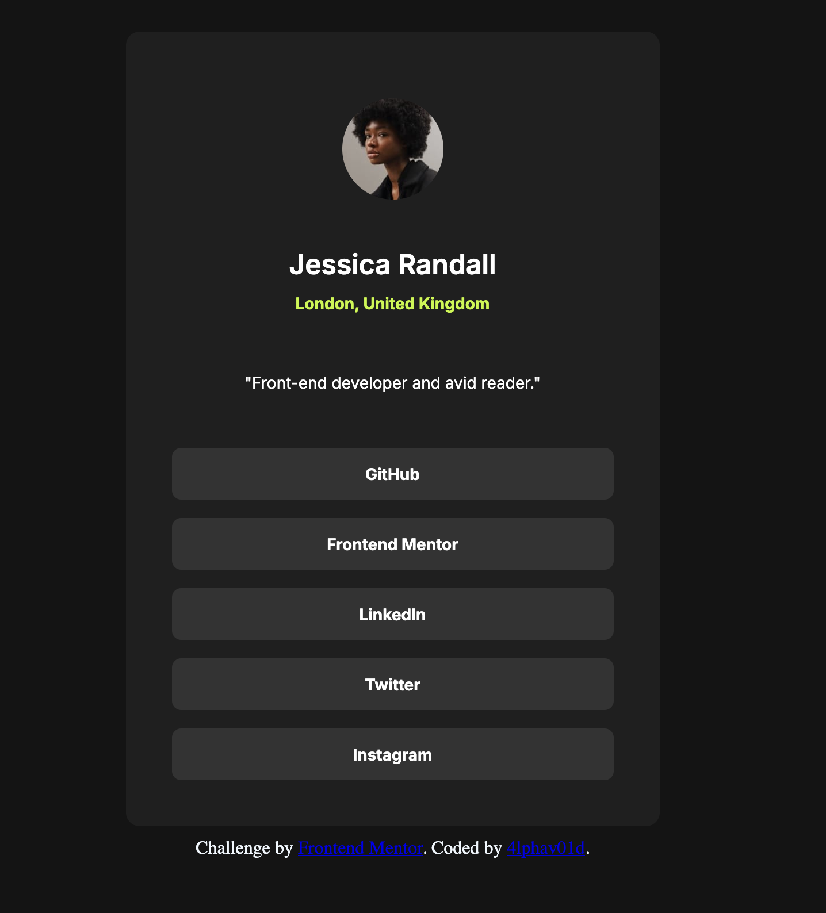

# Frontend Mentor - Social links profile solution

This is a solution to the [Social links profile challenge on Frontend Mentor](https://www.frontendmentor.io/challenges/social-links-profile-UG32l9m6dQ). Frontend Mentor challenges help you improve your coding skills by building realistic projects. 

## Table of contents

- [Overview](#overview)
  - [The challenge](#the-challenge)
  - [Screenshot](#screenshot)
  - [Links](#links)
- [My process](#my-process)
  - [Built with](#built-with)
  - [What I learned](#what-i-learned)
  - [Continued development](#continued-development)
  - [Useful resources](#useful-resources)
  - [AI Collaboration](#ai-collaboration)
- [Author](#author)

**Note: Delete this note and update the table of contents based on what sections you keep.**

## Overview

### The challenge

Users should be able to:

- See hover and focus states for all interactive elements on the page

### Screenshot

### Links

- Solution URL: [Add solution URL here](https://your-solution-url.com)
- Live Site URL: [Add live site URL here](https://your-live-site-url.com)

## My process

### Built with

- Semantic HTML5 markup
- CSS custom properties
- Flexbox
- Mobile-first workflow

### What I learned

Still applied the concepts that I had learned from flexbox. 

### Continued development

I am keen on learning how to use grids to design responsive layouts. 

### Useful resources

- [Deepseek](https://chat.deepseek.com) - I used openrouter's deepseek V4 flash model to ask questions about already written code and debug the codebase. Really worked as a code buddy. 

- [CSS Tricks flex-box guide](https://css-tricks.com/snippets/css/a-guide-to-flexbox/) - This is an article which helped me as a reference in applying css flex box concepts intuitively. 

### AI Collaboration

Describe how you used AI tools (if any) during this project. This helps demonstrate your ability to work effectively with AI assistants.

- **Tools that I used**: Deepseek v4 flash using opencode harness.
- **How I used them**: debugging and brainstorming solutions
- **What worked well & What didn't**: Sometimes the model needed a little bit of steering in order for it to understand my pov + what I needed to do. In eseence, it all came down to asking the right questions. 

## Author

<!-- - Website - [Add your name here](https://www.your-site.com) -->
- Frontend Mentor - [@4lphav01d](https://www.frontendmentor.io/profile/4lphhav01d)

